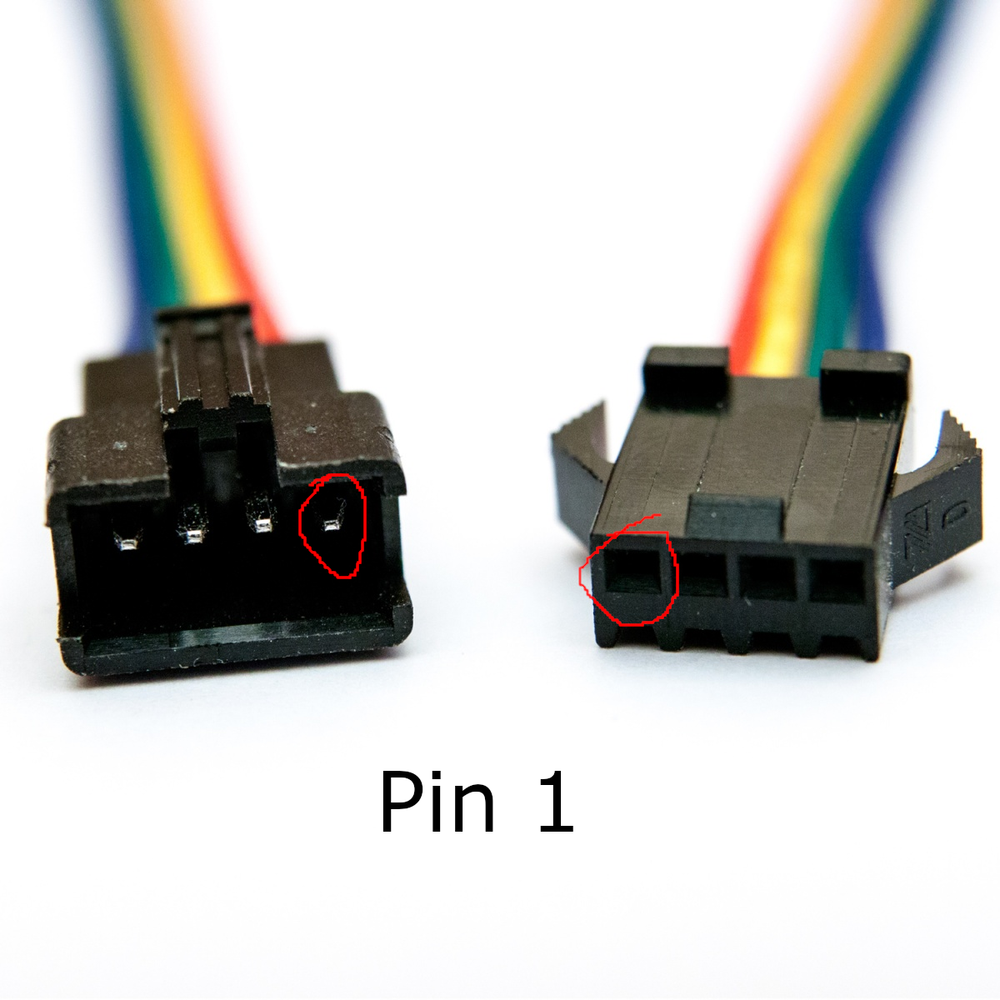
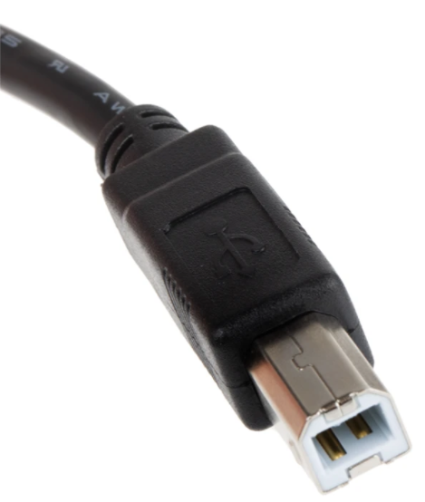
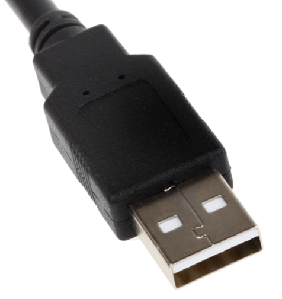

# Kolejność pinów w konektorze

# Wtyczka USB typu B

| Lp. | Sygnał | Color żyły zgodnie z standardem USB |
| --: | ------ | ----------------------------------- |
|   1 | VCC    | Czerwoy                             |
|   2 | D-     | Biały                               |
|   3 | D+     | Zielony                             |
|   4 | GND    | Czarny                              |

# Wtyczka USB typu A

| Lp. | Sygnał | Color żyły zgodnie z standardem USB |
| --: | ------ | ----------------------------------- |
|   1 | VCC    | Czerwoy                             |
|   2 | D-     | Biały                               |
|   3 | D+     | Zielony                             |
|   4 | GND    | Czarny                              |
